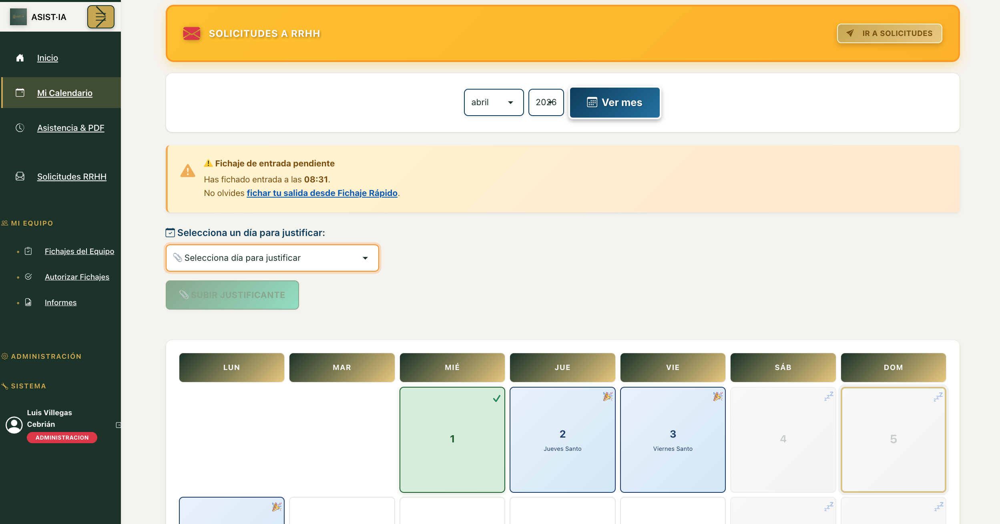
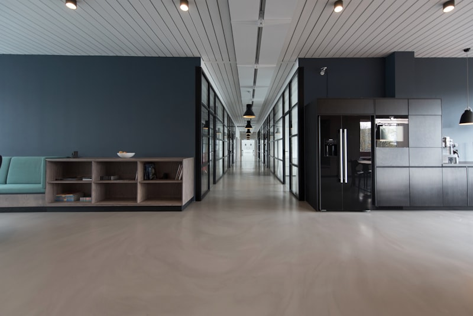

# 🌐 ASIST·IA — Landing Page

Página de captación de clientes para **ASIST·IA**, la plataforma SaaS de control horario para empresas españolas.

---

## 📁 Estructura del proyecto

```
pagina-web-ASISTIA/
├── index.html                  # Página principal
├── assets/
│   ├── css/
│   │   └── styles.css          # Estilos completos (variables, responsive, animaciones)
│   ├── js/
│   │   └── main.js             # Animaciones, formulario, menú móvil
│   └── img/
│       ├── logo-asistia.png    # Logo oficial
│       ├── luis-villegas.jpeg  # Foto fundador
│       ├── capturas/           # ⭐ Añadir capturas de la app aquí
│       │   ├── dashboard.png
│       │   ├── fichaje.png
│       │   ├── calendario.png
│       │   ├── solicitudes.png
│       │   ├── informe.png
│       │   └── login.png
│       └── ambiente/           # ⭐ Añadir fotos de ambiente aquí
│           ├── ambiente-01.jpg  # Equipo trabajando en oficina
│           ├── ambiente-02.jpg  # Persona fichando desde móvil
│           └── ambiente-03.jpg  # Reunión RRHH con tablet
└── README.md
```

---

## 🖼️ Cómo añadir imágenes

### Capturas de la aplicación
1. Haz una captura de pantalla de cada sección de ASIST·IA
2. Guárdalas en `assets/img/capturas/` con los nombres indicados arriba
3. En `index.html`, busca el bloque de cada captura (hay comentarios explicativos)
4. Reemplaza el `<div class="captura-placeholder">` por:
   ```html
   
   ```

### Imágenes de ambiente (oficina, equipo, etc.)
1. Descarga imágenes gratuitas de [Unsplash](https://unsplash.com) o [Pexels](https://pexels.com)
   - Búsqueda sugerida: "office team working", "mobile phone clock in", "HR meeting tablet"
2. Guárdalas en `assets/img/ambiente/`
3. En `index.html`, busca el bloque `.img-banda` y reemplaza cada placeholder por:
   ```html
   
   ```

---

## 🎨 Paleta de colores

| Variable              | Color     | Uso                          |
|-----------------------|-----------|------------------------------|
| `--verde-oscuro`      | `#2A3D33` | Fondo principal              |
| `--verde-sup`         | `#344D3E` | Fondo secciones alternadas   |
| `--dorado`            | `#C9A84C` | Acentos, CTAs, títulos em    |
| `--azul`              | `#4A6FA5` | Badges legales, detalles     |
| `--texto`             | `#EDE8DC` | Texto principal              |
| `--texto-suave`       | `#A8B5A0` | Texto secundario             |

---

## 🚀 Publicar en GitHub Pages

1. Crea un repositorio en GitHub (ej: `asistia-landing`)
2. Sube todos los archivos de esta carpeta
3. Ve a **Settings → Pages → Source → main branch → / (root)**
4. Tu landing estará disponible en: `https://tuusuario.github.io/asistia-landing`

---

## 📧 Contacto configurado

| Tipo          | Email                              |
|---------------|------------------------------------|
| Asesoramiento | AsesoramientoAsistia@outlook.es    |
| Gerencia      | asistia.web@outlook.com            |

---

## ✅ Checklist antes de publicar

- [ ] Añadir capturas de la aplicación en `assets/img/capturas/`
- [ ] Añadir imágenes de ambiente en `assets/img/ambiente/`
- [ ] Crear imagen OG para redes (`assets/img/og-asistia.png`, 1200×630px)
- [ ] Crear páginas legales: `privacidad.html`, `aviso-legal.html`, `cookies.html`
- [ ] Conectar formulario a servicio de email (Formspree, EmailJS, o backend propio)
- [ ] Actualizar URL de LinkedIn real en el HTML
- [ ] Verificar en móvil antes de publicar

---

## 🛠️ Tecnología de la landing

- **HTML5** semántico y accesible (WCAG AA)
- **CSS3** con variables personalizadas, responsive mobile-first
- **JavaScript** vanilla (sin dependencias)
- **Google Fonts**: Syne + DM Sans

---

*© 2026 ASIST·IA · Luis Villegas Cebrián · Todos los derechos reservados*
